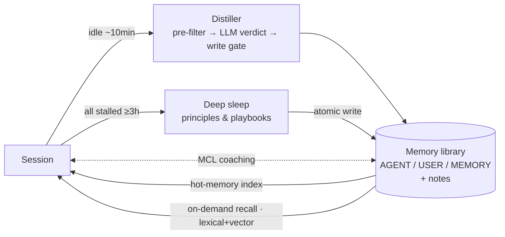

# Shoucang 守藏 · Long-term Memory Plugin for DSH

**Give your [DeepSeek Harness](https://github.com/deepseek-ai/deepseek-harness) (DSH) assistant persistent memory across sessions: it sediments, reflects, recalls and forgets automatically — fully local, zero upload.**

**[简体中文](README.md) | [English](README.en.md)**

    

> *Shoucang* (守藏): "to guard and preserve — collect well, never forget." Install it and forget about it — the plugin keeps memory tidied for you.

## 💡 The problem, answered

| Without memory | With Shoucang |
|---|---|
| Amnesia every session: same pitfalls re-stepped, preferences re-explained | The **distiller** sediments "what is worth remembering" from your real sessions — no manual upkeep |
| Hand-written memory files rot and grow, choking the context window | **Dual personas + capacity gates**: oversized entries are rejected at the write gate; stale ones auto-demote and archive |
| RAG remembers documents, not *you* | The memory source is your own sessions; recall goes **situation-first** (what you're doing / who is involved), then content similarity |
| Context bloats as memory piles up | Only a **light index** is injected per turn (budgeted); details are fetched on demand via pointers |

## ✨ Features

- 🧠 **Long-term memory library** — layered: personas (AGENT / USER) + knowledge index (MEMORY) + topic notes
- 🏭 **Session distillation** — ~10 min after a session goes idle: signal-word pre-filter (zero LLM cost for irrelevant sessions) → contract-based LLM adjudication → whitelist write gate
- 🌙 **Deep sleep** — once all sessions stall for ≥ 3 h, a consolidation pass distills *learned principles* and *task playbooks* into the agent persona (dual-channel: self + user)
- 🔀 **Hybrid retrieval** — lexical (code) + local embeddings (bge-m3, OpenAI-compatible endpoint) fused with RRF; falls back to pure lexical automatically
- 🧭 **Meta cognitive loop (MCL)** — on unfamiliar tasks the first step gets a thin contract + experience pointers ("recall before acting"); familiar tasks pay zero extra round-trips
- 🪶 **Active forgetting** — hot/warm/cold activity tiers; long-unrecalled entries demote, purify and archive — the library never grows unbounded
- 💬 **Memory rings** — decisions, commitments, relationships and time-scoped facts recorded as rings, surfaced by current situation ("what I promised you" pops up when due)
- 🖥️ **Settings panel** — sidebar + host settings entry: memory browser, personas, distillation & sleep stats, parameter tuning, live observability; follows host theme
- 🔒 **Privacy by default** — data stays on your machine; no telemetry; every write commits a local git snapshot (diff / rollback anytime)

## 🚀 Quickstart

```sh
dsh plugin --profile web add github:Fishsb/dsh-shoucang-memory
dsh web
```

**Three things you should see right after install**:

1. A "Shoucang" entry in the DSH sidebar (plus a section in host Settings);
2. A one-line 🧠 hot-memory pointer block in every turn's context (example below);
3. Your first distillation run in the panel's *Observability* view ~10 min after a session ends.

Optional: install [Ollama](https://ollama.com), pull `bge-m3`, and semantic recall turns on automatically — no config needed; without it, lexical retrieval works alone.

### What gets injected each turn (illustrative)

```text
🧠 Recent growth (last deep-sleep consolidation, with verifiable source pointers):
  [Principle] Verify pattern-derived sets · enumerate glob-matched targets before execution → notes/lessons.md §deletion-boundaries
[Shoucang · Hot memory] Three-layer criteria (when to do what):
· Mid/action layer: stop and backtrack after 2 consecutive no-progress attempts
- [Principle] Trust outcome evidence, not success codes → notes/lessons.md §false-green
```

Only lightweight index lines stay resident (budgeted, rotated on demand); details are fetched from the library via pointers — more memory, less context bloat.

## 🔄 How it works



Reliability: watermark-based crash safety (host restarts neither repeat nor lose runs), retry on transient failures, and per-item write-gate audits (even rejections are logged and visible).

## 📁 Memory library layout

| Layer | File | Content |
|---|---|---|
| Persona | `AGENT.md` | The agent's self-model: role / steady practices / boundaries / **learned principles** / **task playbooks** |
| Persona | `USER.md` | Your profile — preferences, habits, red lines |
| Index | `MEMORY.md` | Knowledge index: one pointer per line into details, loaded lightly each turn |
| Details | `notes/*.md` | Topic files (tools / flows / lessons / env / user / agent), fetched via pointers |

- **Capacity gates** — hard character caps on personas and index (defaults 3,000 / 3,000 / 5,000, tunable); oversized entries are rejected — quality over quantity
- **Activity lifecycle** — active → warm (14 days without hits) → cold (44) → archive candidate (90); reinforcement and demotion are hit-driven
- **Local versioning** — every successful write commits a git snapshot inside your local library; diff / revert anytime

## 🖥️ Settings panel

Sidebar entry in the DSH web UI (pure-frontend; theme follows the host):

- **Memory** — capacity cards, index / candidates / notes / archive / trends
- **Personas** — USER / AGENT pointer rows, one click into the detail section
- **Deep sleep** — five-state session badges, stall timers, manual consolidation, tunable thresholds
- **Rings** — decisions / commitments / relationships / time-scoped facts and their follow-up
- **Observability** — distillation & recall ledger, injection preview, key metrics
- **Parameters & config** — every switch/slider writes back instantly (backup first); suite assembly status, raw YAML editing

## ⚙️ Configuration (common keys)

Flat single-layer config; defaults mean "works out of the box":

| Key | Default | Description |
|---|---|---|
| `enableDistill` | on | Distillation master switch |
| `idleWakeMs` | 10 min | Idle threshold after a session |
| `distillPrescan` | on | Signal-word pre-filter |
| `distillModel` / `sleepModel` | inherit main | Per-pass subagent model overrides |
| `enableDeepSleep` | on | Deep-sleep master switch |
| `deepSleepIdleMs` | 3 h | All-stalled trigger threshold |
| `embedEnabled` | on | Vector recall; auto-fallback when endpoint unreachable |
| `embedBaseUrl` / `embedModel` | Ollama `:11434` / `bge-m3` | OpenAI-compatible embedding endpoint |
| `mclEnabled` | on | Cognitive-loop first-step coaching |
| `capAgent` / `capUser` / `capMemory` | 3000 / 3000 / 5000 | Write-gate character caps |
| `activityWarmDays` / `ColdDays` / `ArchiveDays` | 14 / 44 / 90 | Forgetting cadence (days) |
| `bankGit` | on | Local git snapshots of the library |

See the panel's *Raw config* view for the full list.

## 🔒 Privacy

- Memory data lives only on your machine (default root: `~/.dsh/skills/managing-memory`) — never committed, published or uploaded
- No telemetry; no outbound requests besides the LLM / embedding endpoints *you* configure
- This repo runs a public-tree privacy gate on every commit (personal-info scan, zero hard-coded local paths)
- Uninstall = remove the plugin; keep your memories by simply backing up the library folder

## 🛠️ For developers

```sh
npm install --legacy-peer-deps
npm run typecheck && npm run build
npm test    # single entry: full gate + behavior suite (check-runner)
```

Architecture overview: [docs/ARCHITECTURE.md](docs/ARCHITECTURE.md) — privacy red lines and distillation criteria are all machine-checked in the `npm test` chain.

## 📚 Docs

- [CHANGELOG](CHANGELOG.md)
- [Memory spec & discipline](skill/memory-whitelist-spec.md) (Chinese) — whitelist gate / routing / layering / persona write paths
- [Distillation contract](skill/engine/distill-contract.md) (Chinese) — the LLM adjudication rules
- [Architecture](docs/ARCHITECTURE.md)

---

**License**: [Apache-2.0](LICENSE)
