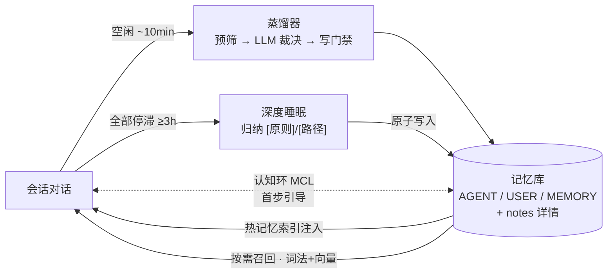

# Shoucang 守藏 · DSH 长期记忆插件

**让你的 [DeepSeek Harness](https://github.com/deepseek-ai/deepseek-harness)（DSH）助理拥有跨会话的长期记忆：自动沉淀、自动反思、自动召回、自动遗忘——全部本机，零上传。**

**[简体中文](README.md) | [English](README.en.md)**

    

> 守藏（shoucang）：取「善于收藏、守而不忘」之意。装上即忘——剩下的交给插件打理。

## 💡 痛点 · 答案

| 没有记忆时 | 守藏的答案 |
|---|---|
| 每个会话失忆：同一个坑反复踩、偏好反复讲 | **蒸馏器**从你的真实会话里自动沉淀「值得记的事」，无需手工维护 |
| 手写记忆文件（CLAUDE.md/AGENTS.md）易腐、越写越长、挤爆上下文 | **双画像 + 容量门**持续维护：超限即拒写，长期不用的自动降级归档 |
| RAG 记得的是文档，不是「你」 | 记忆来源 = 你自己的会话；**先按情境召回**（在做什么 / 涉及谁），再按内容相似找 |
| 上下文被记忆堆积压爆 | 每轮只注入**轻量索引**（预算内），详情按指针按需拉取，不占上下文 |

## ✨ 功能一览

- 🧠 **长期记忆库** — 画像（AGENT / USER）+ 知识索引（MEMORY）+ 详情笔记（notes）分层结构，越用越懂你
- 🏭 **会话蒸馏** — 会话结束空闲约 10 分钟自动唤醒：信号词预筛（无关会话零成本）→ LLM 按蒸馏契约裁决 → 过白名单门禁写库
- 🌙 **深度睡眠** — 全部会话停滞 ≥3 小时后自动复盘：提炼「习得原则」与「任务路径」进 agent 画像，反思双通道同步维护用户画像
- 🔀 **混合召回** — 词法检索（代码）+ 本地向量（bge-m3，OpenAI 兼容端点）RRF 融合；未配置向量服务自动降级为纯词法，功能不缺席
- 🧭 **认知环（MCL）** — 面对不熟悉的任务，首步注入「薄契约 + 经验指针」提醒 agent 先回忆再动手；熟悉任务零额外往返
- 🪶 **主动遗忘** — 记忆分热/温/冷活性级，长期零召回自动降级提纯、归档——库永不无限膨胀
- 💬 **环记录** — 决策 / 承诺 / 关系 / 时态事实记成环，按当前情境供给；「我答应过你的事」到期自动提醒
- 🖥️ **设置面板** — 侧栏与宿主设置中心双入口：记忆库浏览、画像、蒸馏与深睡统计、参数调节、运行观测；深浅色跟随宿主主题
- 🔒 **全本地隐私** — 记忆只存你本机，不随仓库发布、无遥测；库每次写入自动 git 快照，可 diff 可回滚

## 🚀 快速开始

```sh
dsh plugin --profile web add github:Fishsb/dsh-shoucang-memory
dsh web
```

**装上后你应看到三件事**：

1. DSH 侧栏出现「守藏」入口（宿主设置中心也有独立区块）；
2. 新会话起每轮上下文带一行 🧠 热记忆指针（见下例）；
3. 一次会话结束约 10 分钟后，面板「运行观测」记录第一轮蒸馏。

可选增强：本机装 [Ollama](https://ollama.com) 并拉取 `bge-m3` 模型，即启用语义向量召回（不装自动回退词法，无需任何配置）。

### 每轮注入的样子（示意）

```text
🧠 最近成长（上次深睡归纳，带源指针可核验）：
  [原则] 模式派生集合先核对 · 通配命中的集合执行前须显式列举 → notes/lessons.md §删除边界
[守藏·热记忆] 三层判据（何时该做什么）：
· 中层/行动级：连续 2 次无实质进展即停下回溯；线索变弱即换向
- [原则] 结果验证重实证 · 接口成功≠达成，须看实质证据 → notes/lessons.md §假绿与实证
```

常驻的只有轻量索引行（预算受控、按需轮换），详情按指针从库中拉取——记忆越多，上下文越不虚胖。

## 🔄 工作原理



工程上的可靠性：水位断点安全（宿主重启不重复、不丢失）、失败可重试（瞬时故障回滚水位）、写门逐条留审计（拒收也记原因，面板可见）。

## 📁 记忆库结构

| 层 | 文件 | 内容 |
|---|---|---|
| 画像 | `AGENT.md` | agent 自我画像：角色 / 稳定做法 / 能力边界 / **习得原则** / **任务路径** |
| 画像 | `USER.md` | 用户画像：偏好、习惯、红线——「越用越懂你」的载体 |
| 索引 | `MEMORY.md` | 知识索引：一行一条指针指向详情，每轮轻量加载 |
| 详情 | `notes/*.md` | 按主题分文件（tools / flows / lessons / env / user / agent），按指针取用 |

- **容量门** — 画像与索引各有字符上限（缺省 3,000 / 3,000 / 5,000，可调）；超限条目写门直接拒绝，宁缺毋滥
- **活性生命周期** — active → warm（缺省 14 天无命中）→ cold（44 天）→ 归档候选（90 天）；加深、降级均由命中数据驱动
- **本地版本化** — 每次成功写库提交一个 git 快照（存于本机库目录内），随时 diff / 回滚

## 🖥️ 设置面板

DSH 网页侧栏入口（纯前端面板，深浅色跟随宿主主题）：

- **记忆库** — 三索引容量卡、知识索引 / 候选区 / 笔记 / 归档区 / 统计趋势
- **画像** — USER / AGENT 指针行，点击直达详情小节
- **深度睡眠** — 会话五态徽章（RUNNING/ENDED/PROBING/SUSPECT/STALLED）、停滞计时、手动归纳、阈值可调
- **环记录** — 决策 / 承诺 / 关系 / 事实现值与回收
- **运行观测** — 蒸馏与召回日志台账、注入面预览、关键指标
- **参数与配置** — 全部开关滑块即时写回（备份先行）；suite 装配状态、配置 YAML 原文编辑

## ⚙️ 配置（常用项）

扁平单层配置，面板或配置文件均可改，缺省即「零配置可用」：

| 键 | 缺省 | 说明 |
|---|---|---|
| `enableDistill` | 开 | 蒸馏总开关 |
| `idleWakeMs` | 10 分钟 | 会话结束后唤醒蒸馏的空闲阈值 |
| `distillPrescan` | 开 | 信号词预筛：无关会话零 LLM 成本跳过 |
| `distillModel` / `sleepModel` | 继承主会话 | 蒸馏 / 深睡子代理可各自指定模型 |
| `enableDeepSleep` | 开 | 深度睡眠总开关 |
| `deepSleepIdleMs` | 3 小时 | 全部会话停滞触发阈值 |
| `embedEnabled` | 开 | 向量召回；端点不可达自动降级词法 |
| `embedBaseUrl` / `embedModel` | Ollama `:11434` / `bge-m3` | OpenAI 兼容向量端点（可换云端） |
| `mclEnabled` | 开 | 认知环首步引导 |
| `capAgent` / `capUser` / `capMemory` | 3000 / 3000 / 5000 | 写门容量字符上限 |
| `activityWarmDays` / `ColdDays` / `ArchiveDays` | 14 / 44 / 90 | 遗忘节奏（天） |
| `bankGit` | 开 | 记忆库本地 git 快照 |

完整键清单见面板「配置原文」视图。

## 🔒 隐私

- 记忆数据只存**你本机**的 DSH 家目录（默认 `~/.dsh/skills/managing-memory`），不入库、不发布、不上报
- 无遥测、无外部依赖服务——除你自己配置的 LLM / 向量端点外不发任何请求
- 仓库带「公开树隐私门」机检：每次提交扫描个人信息，代码与文档零硬编码本机路径
- 卸载即删插件；想保留记忆，直接备份库目录即可

## 🛠️ 开发者

```sh
npm install --legacy-peer-deps
npm run typecheck && npm run build
npm test    # 单一入口：机检 + 行为测试全家桶（check-runner）
```

改少量文件时不必等全量（143 件串行约 2 分钟）——按需选择：

```sh
node scripts/check-runner.mjs --list                      # 列出全部件（不执行）
node scripts/check-runner.mjs --only check-judge-kind     # 只跑匹配该子串的件（约 0.2s）
node scripts/check-runner.mjs --only a,b,c                # 逗号分隔多件
node scripts/check-runner.mjs --fast                      # 跳过在册慢件（约 50s，默认 2 分钟）
```

`--only` 只认显式点名：写错子串、命中 0 件时会**直接报错退出**（不会静默跑 0 件当作通过），
且子集摘要自带「非全量」标记。`--fast` 跳过 4 件在册慢件（实测 >5s，如 `test-split-equivalence`
与 `ui-geo-regress`，合计约占全量 60%），跳过哪几件会**逐条打印**，摘要同样标注「非全量」。
两者**默认都不生效**——**合入 / 发版前必须跑不带任何开关的全量 `npm test`。**

架构总览见 [docs/ARCHITECTURE.md](docs/ARCHITECTURE.md)；蒸馏判据与隐私红线的机检均挂在 `npm test` 链上。

## 📚 文档

- [CHANGELOG 更新日志](CHANGELOG.md)
- [记忆规格与纪律](skill/memory-whitelist-spec.md) — 白名单门禁 / 路由 / 分层 / 双画像写入口径
- [蒸馏契约](skill/engine/distill-contract.md) — LLM 子代理的裁决规则
- [架构总览](docs/ARCHITECTURE.md)

---

**License**: [Apache-2.0](LICENSE)
