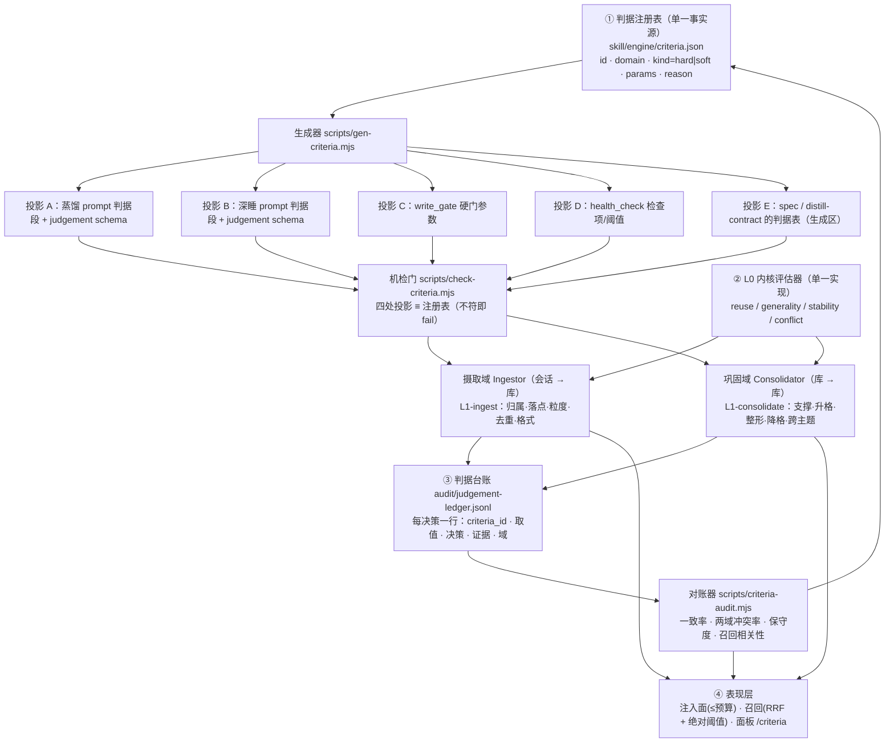

# 记忆核心 v2 目标架构方案（root-cause · 一次到底）

> **状态：✅ 已实现**（P0–P4 全部落地：`25ec28f` 主体 + `61e8f10` 收尾；ADR-122）。本档**保留为设计依据与判因记录**，实施进度与后续演进见 `memory-core-roadmap.md`（总纲）。新读者请从总纲进入。

> **性质**：架构重构方案（先拍板后动码，守 arch-view「架构先行协议」）。
> **一句话目标架构**：把「判据」从**散落在自然语言与多处常量里的约定**，升级为 **单一数据源（判据注册表）→ 生成全部投影 → 机器校验一致 → 决策留痕可对账** 的四层管道；同时把**摄取域**与**巩固域**在架构上正式分离，接口（升格链）形式化为状态机。
> **为什么这次"一次到底"**：已发现的问题看似九处，结构上只有 **4 条根因**（§1）。这 4 条的共同形态是「**同一事实存在多份自然语言拷贝 + 没有任何机器校验 + 决策不留痕**」——只要判据变成数据、投影由生成、一致由机检、决策入台账，**「漂移/不可度量/域混装」在结构上不再可能发生**，而不是"这次修好、下次再漂"。
> **不变量（不得破）**：单库化 + 多级指针 · 深睡 done 才推水位/失败回滚 · 运行态不入库 · 零硬编码 · 单一实现 · 写门纪律。**存量记忆数据零迁移**（§4.2）。

## 1. 根因分析（九处症状 → 4 条结构根因）

| 观测到的症状（证据） | 结构根因 |
|---|---|
| 四问里有死支 `规则→SOUL.md`（`spec:42-43`，而 `targets.ts:178-182` 与 `memory-append.mjs:23-24` 的白名单都没有它）· R2 与 Q2b 重叠（`distill.ts:266` vs `spec:43`）· 深睡借 R1 词表当粒度锚（`distill.ts:284`）· 改一个容量数要同步「四处投影 + 宿主五处」（`memory_write_gate.mjs:32-39` 自述） | **R1｜判据没有单一事实源**：判据以自然语言 + 多处常量存在 N 份拷贝，漂移是必然而非偶然 |
| 判据全在 prompt 散文（`distill.ts:265-276` / `:283-296`）；宿主只硬校验 route/白名单/格式/容量+唯一性（`distill.ts:784`、`:860`、`memory_write_gate.mjs:140-152`） | **R2｜判据与强制两层脱节**：说一套（模型自觉）· 强制一套（宿主 4 项），中间没有映射 |
| 判据命中情况不入审计（审计只记 `route/stop/fclass/added/rejected`，`distill.ts:386`）；升格链只有一句"生命周期"（`spec:311-313`）而深睡用条目级频次（`distill.ts:283-285`） | **R3｜无反馈回路**：决策不留判据痕迹 ⇒ 无法验证判据 ⇒ 无法收敛 |
| 摄取（会话→库）与巩固（库→库）共用一段 prompt 骨架与同一批材料，边界靠措辞（`distill.ts:262-309` 一个文件两段 prompt） | **R4｜两域未在架构上分离**：职责混装，接口未形式化 |

> 结论：**不能靠"再写一版更全的 prompt"解决**——那只会把 R1 的拷贝数从 4 涨到 5。必须换承载形式。

## 2. 目标架构（四层管道）



### 2.1 第 ① 层：判据注册表（消灭 R1）
- **唯一承载**：`skill/engine/criteria.json`。每条判据一条记录：
  ```json
  { "id": "ingest.route.r3-project", "domain": "ingest", "kind": "hard",
    "params": { "route": "project", "target": "<workspace>/docs/devref/shoucang/" },
    "appliesWhen": "项目专属事实（单项目语境）", "reasonTemplate": "R3 项目专属 → 直写项目工作区",
    "since": "v2", "supersedes": "spec§1.1 R3" }
  ```
- **只允许生成，不允许手写投影**（五处投影见 §3.2）。删除投影里的手写常量。
- 四问**降级为注册表里的 `ingest.route.q*` 子判据组**；`SOUL.md` 死支**直接删除**（规则类改指 `skill/` 只读文档，永不入册）。

### 2.2 第 ② 层：双域分离 + L0 内核（消灭 R4）
| 域 | 输入 → 输出 | L1 判据（注册表 id 前缀） |
|---|---|---|
| **Ingestor**（摄取，高频） | 会话增量 → `appends/newIndex/profiles/projectCards/skipped` | `ingest.route.*`（含 q0-q3 子判据）· `ingest.placement.*`（notes 哪类哪节）· `ingest.granularity.*`（并入 vs 裂 `###`，R/K 律）· `ingest.dedup.*`（精确/bigram≥0.66）· `ingest.format.*`（§8 四要素） |
| **Consolidator**（巩固，离线） | 库视图 → `principles/pointerOps/treeOps/forgetOps/crossTopic/profileOps` | `consolidate.support.*`（稳定性 + 证据条数）· `consolidate.promote.*`（notes→`[原则]/[路径]`）· `consolidate.reshape.*`（§8.1 律）· `consolidate.demote.*`（cold+≥90d+三守卫）· `consolidate.cross.*`（≥2 §）· `consolidate.premise.*`（**新增**：结论是否依赖未写出的隐含前提） |
- **L0 内核**（两域共调，单一实现）：`reuse`（跨任务/跨项目/仅本会话）· `generality`（方向指引/契约事实/细节条文）· `stability`（单次/当日/跨日或多会话）· `conflict`（无/并存/取代）。
- **升格链 = 显式状态机**（接口形式化，替代 `spec:311-313` 的一句话）：
  `session → candidate → note → {principle|path} → archive`，每条边由注册表里的 `consolidate.promote.*` / `consolidate.demote.*` 判据把关。

### 2.3 第 ③ 层：判据台账与对账（消灭 R3）
- 每次决策写一行 `audit/judgement-ledger.jsonl`：`{at, domain, criteria_id, judgement:{L0四维 + 域判据}, decision, evidenceRefs, hostEnforced:bool}`。
- `scripts/criteria-audit.mjs` 出四项数字：**判据-结果一致率**（判"跨任务"的条目 N 天内是否被跟读）· **两域冲突率**（同主题摄取判 notes 而巩固判原则）· **保守度**（rejected+skipped 占比）· **召回-判据相关性**。
- 对账结果**回流注册表**（人工拍板调整阈值/删死支），形成闭环 —— 这是本方案"一次到底"的关键：**判据本身可被验证**。

### 2.4 第 ④ 层：表现层与运维面归位
- **检索口径写进注册表**（`surface.retrieval.*`）：融合 = **RRF（排名，k=60）**；阈值 = **绝对余弦**；rerank = **触发门**（索引 >200 行或跟读率两次下降才评估）——落点 `vec.ts:254-255`（融合段）、`mcl.ts:210/213`（阈值口径）。
- **运维三项纳入架构**（不再是补丁）：体检 `/doctor` 化（注入 token 账 + 放置审计，`memory_health_check.mjs:35-42`）· 库 **git 版本化**（每次写门通过即 commit）· 面板新端点 **`/criteria`**（判据表 + 健康报告 + 一键重生成投影）。

## 3. 关键契约

### 3.1 三层判据的取值域（枚举，不打分——避免魔法数）
| 层 | 判据 | 取值 |
|---|---|---|
| L0 | reuse / generality / stability / conflict | 跨任务·跨项目·仅本会话 / 方向指引·契约事实·细节条文 / 单次·当日·跨日 / 无·并存·取代 |
| L1-ingest | route / placement / granularity / dedup / format | memory·project·discard / 7 类 notes + 节 / 并入·裂 ### / 通过·拒收 / 合规·违规 |
| L1-consolidate | support / promote / reshape / demote / cross / premise | 达标·不足 / 升格·保持 / split·merge·rename·no-op / archive·keep / ≥2§·不足 / 依赖前提·自洽 |
| L2 | cost | 误注入代价 > 漏写代价 ⇒ 默认保守；拒绝必给理由 |

### 3.2 投影清单（生成，不手写）与机检
| # | 投影 | 现手写位置（改造点） |
|---|---|---|
| A | 蒸馏 prompt 判据段 + `judgement` schema | `src/distill.ts:265-276`（`DEFAULT_DISTILL_PROMPT`） |
| B | 深睡 prompt 判据段 + `judgement` schema | `src/distill.ts:283-296`（`DEEP_SLEEP_PROMPT`） |
| C | 写门硬门参数 | `skill/scripts/memory_write_gate.mjs:40-46`（容量/警戒）、`:99-118`（格式/§存在） |
| D | 体检检查项/阈值 | `skill/scripts/memory_health_check.mjs:35-42`（INDEX_FILES/tags/NOTES_WARN） |
| E | 判据表（文档生成区） | `skill/memory-whitelist-spec.md:27-46`（§1 总则）、`skill/engine/distill-contract.md` 判据节 |

- **机检门**：`scripts/check-criteria.mjs` 逐条比对「注册表 ↔ 五处投影」，不符 exit 1，且纳入 `npm test`（与 `check-hardcode` 同级）。**这就是把"改一处漏一处"从人为纪律变成 CI 级约束**。

## 4. 迁移路径（零行为切换 → 加观测 → 才调参）

> 直接对应 `[原则] 变更先判因备份`：**先判因（§1）· 不整组覆盖 · 每步可回滚**。

| 步 | 内容 | 行为变化 | 回滚 |
|---|---|---|---|
| **M1 纯重构** | 从现值**反写**注册表（prompt/gate/health/spec 的常量与判据抽出来）→ 生成器 + 机检门 + 五处投影改由生成 | **零**（生成产物与现值逐字等价，diff 可证） | `git revert`（O2 已版本化库；仓内 git 覆盖代码） |
| **M2 加观测** | 两域输出加 `judgement` 字段（可选）→ 宿主写台账；对账器首次出数 | 零（只多写审计；prompt 只多一个可选字段） | 契约版本回退（字段可选，宿主兼容旧输出） |
| **M3 数据驱动调参** | 用 M2 的台账调整 L0/L1 阈值与死支（含四问降级、SOUL.md 删除、升格链判据） | **此处才改行为**，且每项有 A/B | 注册表版本号 + 面板一键回滚到上一版判据 |

- **存量数据零迁移**：库仍是 Markdown 单库、三主档 + notes + 指针；注册表只描述**判据**不描述数据；`notes/INDEX.md` 元数据表继续作台账（新增「关联主题」列替代实体图）。
- **不动**：深睡水位语义、写门三闸口、MCL 双通道、架构档体系、单库化边界。

## 5. 一次性收益（对照根因）

| 根因 | 一次到底的处置 | 验收判据 |
|---|---|---|
| R1 判据多拷贝 | 注册表唯一承载 + 五处生成 + 机检门 | `check-criteria.mjs` 常绿；历史"改一处漏一处"类缺陷不再可能 |
| R2 判据/强制脱节 | 注册表每条标 `kind=hard|soft`，台账记 `hostEnforced` | 每个 `[原则]`/`[路径]` 都能回答"谁强制、在哪强制" |
| R3 无反馈回路 | judgement 台账 + 对账器 + 回流注册表 | 一致率/冲突率/保守度有基线且可按月对比 |
| R4 两域混装 | Ingestor / Consolidator 分离 + L0 共用内核 + 升格链状态机 | 两域 prompt 不再互借词表；冲突率可测 |
| 检索口径漂移 | retrieval 口径入注册表（RRF + 绝对阈值 + rerank 触发门） | 固定窗口 A/B：跟读率不降 |
| 运维旁路 | 体检 token 账 / 库 git / `/criteria` 面板 | 每次写入可 diff；注入 token 账 ≤ 预算 |

## 6. 风险与明确不做

**风险**：① 生成器引入构建依赖 → 用零依赖 node 脚本，且生成产物入库（无运行时依赖）；② 判据字段膨胀 → 取值域**枚举封顶**（见 §3.1），新增判据必须删一条旧判据或证明其正交；③ 迁移期两套并存的混乱 → 以机检门为唯一切换开关（M1 结束即常绿）。

**不做**：实体图/图库（单用户单机；用 INDEX「关联主题」列弱关联）· 外部框架依赖（LangGraph/Mem0 作为运行时依赖）· 多租户/RBAC · 动态状态入库 · 无条件 reranker · 深睡二次 LLM 复核 · 记忆库对外 MCP 暴露。

## 7. 工作量与阶段（可执行清单）

| 阶段 | 交付 | 文件级落点 | 回归 |
|---|---|---|---|
| **P0** | 本档过审 + `criteria.json` 草案（从现值反写） | `skill/engine/criteria.json`（新）· 本档 | — |
| **P1** | 注册表 + 生成器 + 机检门（**零行为切换**） | `scripts/gen-criteria.mjs`（新）· `scripts/check-criteria.mjs`（新）· 五处投影改造（§3.2）· `package.json` test 链 | `npm test` + `check-criteria` + prompt 逐字等价 diff |
| **P2** | 两域分离 + L0 内核 + 升格链状态机 | `src/criteria.ts`（新，L0 单一实现）· `src/distill.ts` 两 prompt 改由生成 · 契约 v7 | `test-mcl` 扩展 + 新增 `test-criteria` |
| **P3** | 台账 + 对账器 + 面板 | `src/distill.ts`（写台账）· `scripts/criteria-audit.mjs`（新）· `src/panel.ts` `/criteria`（新路由） | 三指标首个数 + `/criteria` HTTP 200 |
| **P4** | 表现层/运维归位 | `src/vec.ts:254-255`（RRF）· `memory_health_check.mjs`（token 账/放置）· 库 git 钩子 | 固定窗口 A/B + 库 diff 可回溯 |

_建立 2026-09-11 · 依据：根因分析（§1，现码行号）+ 外部对标（Letta `/doctor`/MemFS · Mem0 单遍 ADD-only · RRF · sleep-time compute · LME-V2 五能力 · Anatomy of Agentic Memory）+ 判据域审计四缺口。本档不改任何代码。_
